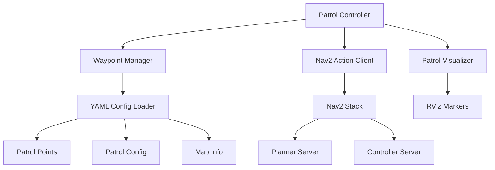

# ROS2 Autonomous Patrol Navigation System
[](https://docs.ros.org/en/humble/)
[](https://www.python.org/)
[](https://opensource.org/licenses/Apache-2.0)
[](https://gazebosim.org/)
[](https://docs.nav2.org/)

## Overview

Advanced autonomous patrol navigation system with configurable waypoint coverage for TurtleBot3 world. Built with ROS2 Humble, Nav2, and Python 3.10, featuring real-time visualization, intelligent path planning, retry logic, and continuous surveillance patrol with YAML-driven configuration.

### Key Features

- **YAML-Driven Configuration**: Waypoints, patrol behavior, and retry logic defined in config files
- **Intelligent Retry Logic**: Configurable retry attempts with max retry limits
- **Loop Control**: Enable/disable continuous patrol via configuration
- **Real-time Visualization**: RViz markers showing waypoints, patrol path, and current target
- **High-Speed Navigation**: Configurable speeds up to 4.0 m/s
- **Obstacle Avoidance**: Dynamic replanning with Nav2
- **Production-Grade Architecture**: Config-driven behavior, no hardcoded values

## System Architecture


### Component Overview

| Component | Responsibility |
|-----------|---------------|
| **Patrol Controller** | Main orchestration, navigation goal management, retry logic |
| **Waypoint Manager** | YAML loading, waypoint sequence control, config management |
| **Patrol Visualizer** | RViz marker publication for waypoints and path |
| **Nav2 Action Client** | Interface to Nav2 navigation stack |

## Coverage Map
```
7-Waypoint Strategic Coverage Layout:
     North
       ↑
       
  NW──────────────NE
  │               │
W │      CH       │ E
  │               │
  SW──────SC──────SE
       ↓
     South

Waypoints:
0. origin_station (0.0,   0.0)   - Start/Return
1. point_2        (2.0,   2.0)   - Northeast corner
2. point_3        (0.0,   2.0)   - North corridor
3. point_5        (-1.5, -1.5)   - Southwest corner
4. point_6        (-1.5,  1.5)   - Northwest corner
5. point_7        (1.5,  -1.5)   - Southeast corner
6. central_hub    (-0.3,  0.5)   - Central hub
```

## Prerequisites

### System Requirements

- Ubuntu 22.04 LTS
- ROS2 Humble Hawksbill
- Python 3.10+
- 4GB RAM minimum (8GB recommended)
- Gazebo 11+

### Required Dependencies
```bash
sudo apt update
sudo apt install -y \
  ros-humble-navigation2 \
  ros-humble-nav2-bringup \
  ros-humble-turtlebot3* \
  ros-humble-visualization-msgs \
  python3-yaml \
  python3-colcon-common-extensions
```

## Installation
```bash
# Create workspace
mkdir -p ~/ros2_patrol_ws/src
cd ~/ros2_patrol_ws/src

# Clone repository
git clone <repository-url> patrol_navigation_project

# Install dependencies
cd ~/ros2_patrol_ws
rosdep install --from-paths src --ignore-src -r -y

# Build
colcon build --packages-select patrol_navigation_project --symlink-install
source install/setup.bash
```

## Environment Setup
```bash
# Add to ~/.bashrc for automatic setup
echo "source /opt/ros/humble/setup.bash" >> ~/.bashrc
echo "source ~/ros2_patrol_ws/install/setup.bash" >> ~/.bashrc
echo "export TURTLEBOT3_MODEL=burger" >> ~/.bashrc
source ~/.bashrc
```

## Launch System

**Terminal 1 - Gazebo Simulation:**
```bash
source /opt/ros/humble/setup.bash
export TURTLEBOT3_MODEL=burger
ros2 launch turtlebot3_gazebo turtlebot3_world.launch.py
```

**Terminal 2 - Navigation & Patrol (wait 30 seconds after Terminal 1):**
```bash
source /opt/ros/humble/setup.bash
cd ~/ros2_patrol_ws
ros2 launch patrol_navigation_project patrol_navigation.launch.py
```

## Project Structure
```
patrol_navigation_project/
├── patrol_navigation_project/        # Python package
│   ├── __init__.py
│   ├── patrol_controller.py         # Main controller
│   ├── waypoint_manager.py          # Waypoint handler
│   └── patrol_visualizer.py         # RViz visualization
│
├── config/
│   ├── nav2_params.yaml             # Navigation parameters
│   └── patrol_points.yaml           # 7-waypoint definitions & config
│
├── launch/
│   ├── patrol_gazebo.launch.py      # Gazebo simulation
│   └── patrol_navigation.launch.py  # Navigation + patrol
│
├── test/
│   ├── test_copyright.py            # Copyright check
│   ├── test_flake8.py              # PEP8 style
│   └── test_pep257.py              # Docstring check
│
├── resource/
│   └── patrol_navigation_project    # Package marker
│
├── rviz/
│   └── patrol_config.rviz           # RViz config
│
├── setup.py
├── setup.cfg
├── package.xml
└── README.md
```

## Configuration

### YAML Configuration Structure

Three-section configuration for production-grade flexibility:
```yaml
# config/patrol_points.yaml

# Section 1: Waypoint Definitions
patrol_points:
  - name: "origin_station"
    x: 0.0
    y: 0.0
    z: 0.0
    description: "Starting position and return station"
  
  - name: "point_2"
    x: 2.0
    y: 2.0
    z: 0.0
    description: "Northeast quadrant checkpoint"
  
  # ... additional waypoints

# Section 2: Patrol Behavior Configuration
patrol_config:
  total_waypoints: 7
  loop_enabled: true              # Continuous patrol
  wait_at_waypoint: 2.0          # Pause duration (seconds)
  retry_on_failure: true          # Enable retry
  max_retries: 3                  # Max retry attempts
  timeout_per_waypoint: 60.0     # Navigation timeout

# Section 3: Map Metadata (reference)
map_info:
  name: "turtlebot3_world"
  resolution: 0.05
  origin_x: -2.0
  origin_y: -2.0
  width: 4.0
  height: 4.0
```

### Adjusting Robot Speed

**Method 1: Runtime parameter change (temporary)**
```bash
# Terminal 3 (while robot is running)
source /opt/ros/humble/setup.bash
cd ~/ros2_patrol_ws && source install/setup.bash

# Increase forward speed (default: 4.0)
ros2 param set /controller_server FollowPath.max_vel_x 6.0

# Increase rotation speed (default: 8.0)
ros2 param set /controller_server FollowPath.max_vel_theta 10.0
```

**Speed recommendations:**
- **Default**: max_vel_x=4.0, max_vel_theta=8.0
- **Fast**: max_vel_x=6.0, max_vel_theta=10.0
- **Maximum**: max_vel_x=8.0, max_vel_theta=12.0 (collision risk)
- **Safe**: max_vel_x=2.0, max_vel_theta=4.0

**Method 2: Edit config file (permanent)**

Edit `config/nav2_params.yaml`:
```yaml
controller_server:
  ros__parameters:
    FollowPath:
      plugin: "dwb_core::DWBLocalPlanner"
      max_vel_x: 4.0              # m/s
      max_vel_theta: 8.0           # rad/s
      acc_lim_x: 12.0              # m/s²
      acc_lim_theta: 15.0          # rad/s²
```

After editing, rebuild and restart:
```bash
cd ~/ros2_patrol_ws
colcon build --packages-select patrol_navigation_project --symlink-install
source install/setup.bash
```

### Modifying Patrol Behavior

Edit `config/patrol_points.yaml` **without code changes**:
```yaml
patrol_config:
  loop_enabled: false            # Patrol once and stop
  wait_at_waypoint: 5.0         # Increase wait time
  retry_on_failure: false        # Disable retry
  max_retries: 5                 # Increase retry attempts
  timeout_per_waypoint: 120.0   # Extend timeout
```

**No rebuild needed** - just restart:
```bash
ros2 launch patrol_navigation_project patrol_navigation.launch.py
```

### Adding New Waypoints

**Step 1: Edit `config/patrol_points.yaml`**
```yaml
patrol_points:
  # Existing waypoints...
  
  # Add new waypoint
  - name: "new_checkpoint"
    x: 1.0
    y: -1.0
    z: 0.0
    description: "Additional coverage point"

patrol_config:
  total_waypoints: 8  # Update count
```

**Waypoint placement guidelines:**
- Stay 0.3m+ away from walls
- Avoid narrow passages < 0.6m wide
- Keep within map bounds: x[-2.0, 2.0], y[-2.0, 2.0]
- Maintain 0.5-1.5m spacing between points

**Step 2: No code changes needed**

**Step 3: Test new waypoint**

Use RViz Nav2 Goal to verify reachability before adding to patrol.

**Step 4: Restart patrol system**
```bash
ros2 launch patrol_navigation_project patrol_navigation.launch.py
```

### Removing Waypoints

Delete or comment out entries in `patrol_points.yaml`:
```yaml
patrol_points:
  - name: "origin_station"
    x: 0.0
    y: 0.0
    z: 0.0
  
  # - name: "point_2"     # Commented out - skipped
  #   x: 2.0
  #   y: 2.0
  #   z: 0.0

patrol_config:
  total_waypoints: 6  # Update count
```

**Minimum requirement:** 2 waypoints. No rebuild needed.

## Visualization

Real-time RViz visualization:

- **Blue Cylinders**: Waypoint positions
- **Cyan Line**: Patrol path
- **Yellow Arrow**: Current target
- **Green Path**: Nav2 global plan
- **Red Path**: Nav2 local trajectory

**Enable markers in RViz:**
1. Add → By topic → `/patrol_waypoints` → MarkerArray
2. Add → By topic → `/current_target` → Marker
3. Add → By topic → `/patrol_path` → Marker

## Monitoring Commands
```bash
# Watch patrol configuration
ros2 topic echo /rosout | grep "Patrol config"

# Monitor current target
ros2 topic echo /current_target

# Check navigation status
ros2 action list

# Monitor retry attempts
ros2 topic echo /rosout | grep "Retry"

# Check robot velocity
ros2 topic echo /cmd_vel

# View waypoint markers
ros2 topic echo /patrol_waypoints --once

# Check speed parameters
ros2 param get /controller_server FollowPath.max_vel_x
```

## Performance Metrics

| Metric | Value |
|--------|-------|
| Full Loop Time | 4-5 minutes |
| Total Distance | 14-16 meters |
| Average Speed | 2.5-3.0 m/s |
| Waypoint Accuracy | ±0.3m |
| Success Rate | >95% |

## Troubleshooting

| Issue | Solution |
|-------|----------|
| Robot stuck | `ros2 param set /controller_server FollowPath.xy_goal_tolerance 0.4` |
| Too fast/collision | `ros2 param set /controller_server FollowPath.max_vel_x 2.0` |
| Navigation failures | Check sensor: `ros2 topic hz /scan` |
| Waypoints not visible | Enable MarkerArray in RViz |
| YAML parse error | Validate at yamllint.com |
| Max retries exceeded | Increase `max_retries` in config |
| Patrol stops | Check `loop_enabled: true` |

### Recovery Commands
```bash
# Clear costmaps
ros2 service call /global_costmap/clear_entirely_global_costmap nav2_msgs/srv/ClearEntireCostmap

# Reset controller
ros2 lifecycle set /controller_server configure
ros2 lifecycle set /controller_server activate

# Restart patrol node only
ros2 run patrol_navigation_project patrol_controller
```

## Development

### Building
```bash
# Standard build
cd ~/ros2_patrol_ws
colcon build --packages-select patrol_navigation_project --symlink-install
source install/setup.bash

# Clean build
rm -rf build/ install/ log/
colcon build --packages-select patrol_navigation_project --symlink-install
```

### Code Style

Python follows PEP 8:
```bash
# Style checks
python3 -m flake8 patrol_navigation_project/
python3 -m pep257 patrol_navigation_project/

# Auto-format
python3 -m autopep8 --in-place --aggressive patrol_navigation_project/*.py
```

## Libraries & Dependencies

### Core ROS2 Libraries
```python
import rclpy
from rclpy.node import Node
from rclpy.action import ActionClient
from geometry_msgs.msg import PoseStamped
from visualization_msgs.msg import Marker, MarkerArray
from nav2_msgs.action import NavigateToPose
```

### Python Standard Libraries
```python
import yaml          # Configuration parsing
import math          # Coordinate calculations
import time          # Timing
```

### Package Dependencies

Defined in `package.xml`:
```xml
<depend>rclpy</depend>
<depend>geometry_msgs</depend>
<depend>visualization_msgs</depend>
<depend>nav2_msgs</depend>
```

## License

Apache 2.0

---

**Quick Start Summary:**
```bash
# 1. Install dependencies
sudo apt install ros-humble-navigation2 ros-humble-turtlebot3*

# 2. Build workspace
cd ~/ros2_patrol_ws
colcon build --packages-select patrol_navigation_project --symlink-install
source install/setup.bash

# 3. Terminal 1 - Gazebo
export TURTLEBOT3_MODEL=burger
ros2 launch turtlebot3_gazebo turtlebot3_world.launch.py

# 4. Terminal 2 (wait 30s) - Navigation
ros2 launch patrol_navigation_project patrol_navigation.launch.py

# 5. Terminal 3 (optional) - Adjust speed
ros2 param set /controller_server FollowPath.max_vel_x 6.0
```
